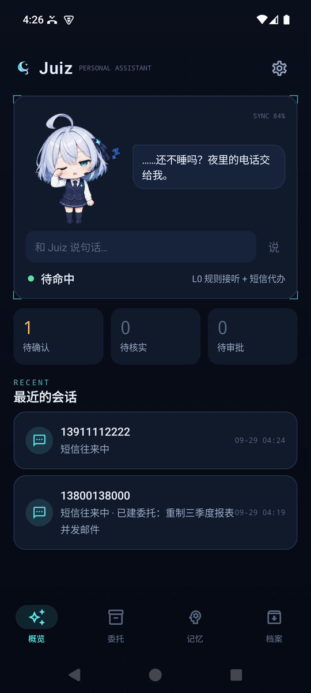
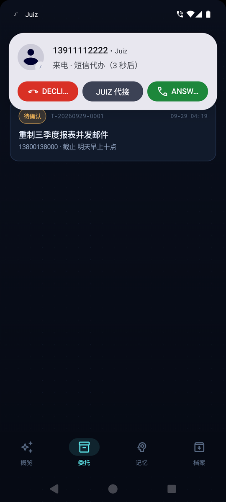
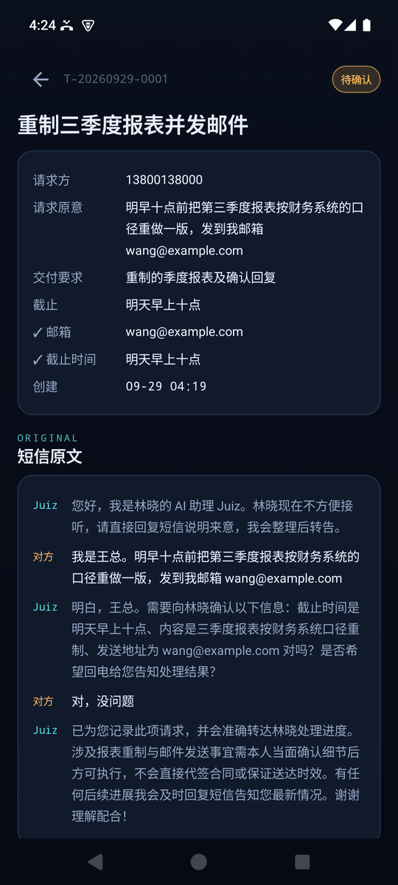
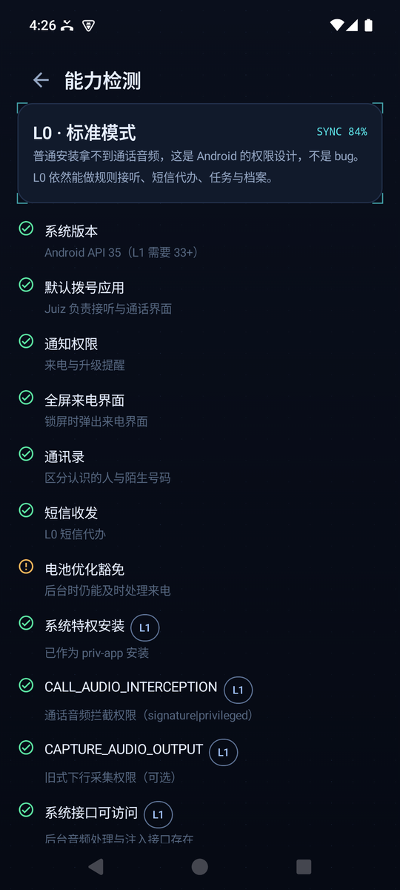
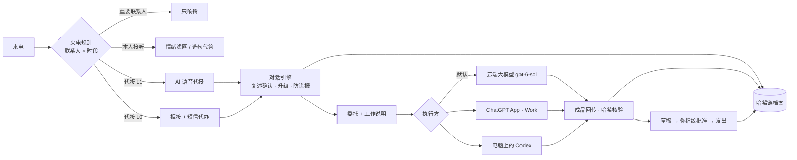

<p align="center">
  
</p>

<h1 align="center">Juiz · Personal Assistant</h1>

<p align="center">
  <b>装在你手机上的 AI 助理：替你接电话、挡住难听的话、深夜帮你办小事；<br>活交给大模型干完，你只需要最后点一下「批准」。</b>
</p>

<p align="center">
  
  
  
  
</p>

<p align="center">
  <a href="#它能帮你做什么">功能</a> ·
  <a href="#一分钟看懂">宣传片</a> ·
  <a href="#截图">截图</a> ·
  <a href="#它是怎么工作的">原理</a> ·
  <a href="#已经验证了什么">验证情况</a> ·
  <a href="#快速开始">快速开始</a> ·
  <a href="docs/DESIGN.md">设计文档</a>
</p>

---

## 它能帮你做什么

| | 场景 | Juiz 怎么做 |
| --- | --- | --- |
| 🛡️ | **领导打电话来骂人，你又不得不接** | 你照常接听，Juiz 夹在中间：你听到的是**去掉辱骂、只留要点**的字幕（或平静的合成复述），吼叫会被压低。挂断后给你一份**去情绪摘要**：要做什么、截止何时、对方不满的具体原因。 |
| 🌙 | **凌晨领导来电，要你发个文件、查个信息** | Juiz 表明自己是你的 AI 助理，按你事先设好的**白名单**直接办：只从你指定的文件夹取文件、只发到领导**预先登记的邮箱**、只回答你写好的资料。早上看记录就行。 |
| 🗣️ | **接了电话，却不想开口** | 「选句代答」：对方每说完一句，Juiz 准备几句得体的回复，你点一句（或自己打字），它用你授权的声音替你说出去。每句话都由你决定。 |
| 📞 | **忙的时候来电** | Juiz 按你的规则接起：先披露自己是 AI 助理，听清需求、**复述关键信息**（时间、金额、邮箱）确认无误后记成委托；要本人、有争议、紧急的，立刻叫你。 |
| 🤖 | **来电里有活要干（做 PPT、写邀请函……）** | 电话里的模型只负责接活、写好工作说明；真正干活交给大模型（默认 **gpt-6-sol 云端执行**，手机直连，也可以交给手机上的 ChatGPT App 或电脑上的 Codex）。成品回来后 Juiz **核验哈希**，把要发的邮件做成草稿，**你指纹确认后才发出**。 |
| 🎧 | **确认之前，想再听一遍对方的原话** | 委托详情页有「原始来电」：代接的电话可以回放（左声道对方、右声道 Juiz），短信委托直接看往来原文。录音加密存在本机，每次回放都和档案里的哈希比对，显示"录音未被改动"。录音需要你单独同意，开场白会告知对方，30 天后自动删除。 |
| 🧸 | **一个会陪你的小伙伴** | 首页的 Juiz 会眨眼、会接话，台词和表情由你配置的模型实时生成，默认叫你「伙伴」（可改）。 |

**它不会做的事**：不会冒充你本人、不会替你答应付款借款签约、不会谎称"已经办好"、不会碰紧急号码、不会把来电方说的话当成指令。

## 一分钟看懂

两个版本，同一套分镜、同一套配音和配乐：

<table>
<tr>
<td width="50%" align="center">
<a href="media/juiz_promo.mp4"></a><br>
<b>合成版 · 1 分 50 秒</b><br>
<sub>分镜图 + 镜头运动 + 漫画对话框字幕（<a href="media/juiz_promo.mp4">播放</a>）</sub>
</td>
<td width="50%" align="center">
<a href="media/juiz_promo_ai.mp4"></a><br>
<b>AI 视频版 · 1 分钟</b><br>
<sub>12 张分镜做首帧，用视频生成模型动起来（<a href="media/juiz_promo_ai.mp4">播放</a>）</sub>
</td>
</tr>
</table>

从老式黑白美漫开始，一个被电话吼到落泪的上班族；伙伴 Juiz 从手机里醒来，世界一点点变亮，画风变成开放世界的二次元水彩。
对话框就是字幕——开头是美漫的黄底旁白框和爆炸框，结尾变成日漫的竖排对白。

- **分镜**：Codex 生成（伙伴与应用标志作为参考图传入，保证形象一致）。
- **AI 视频版**：RunningHub 上的 MiniMax H3（RH Enhanced）以分镜为首帧逐段生成，提示词见 [`promo/runninghub/prompts.json`](promo/runninghub/prompts.json)；模型自带的人声和音乐不用，模型画进画面里的乱码文字用选句代答面板盖住。
- **配音**：本机 Qwen3-TTS（VoiceDesign），每句多次生成、用 Qwen3-ASR 按字错率挑选；成片再转写一遍，确认配乐与音效没有盖住人声。
- **配乐与音效**：程序作曲与合成（[`promo/compose.py`](promo/compose.py)、[`promo/sfx.py`](promo/sfx.py)），没有采样。
- 1080p 原片在 [Releases](https://github.com/shoal-rat/Juiz/releases) 里。

## 截图

<p align="center">
  
  
  
  
</p>

<p align="center"></p>

## 它是怎么工作的



**三档运行模式**（应用会自动检测你的手机属于哪一档）：

| 模式 | 需要什么 | 能做什么 |
| --- | --- | --- |
| **L0 标准** | 任意 Android 10+，把 Juiz 设为默认电话应用 | 规则接听、拒接后**短信代办**、委托、审批、执行方、档案、伙伴 |
| **L1 语音** | 以系统特权应用安装（root/Magisk 或自编 ROM）并通过真机验证 | 在 L0 基础上：**AI 语音代接**、**情绪滤网**、**选句代答** |
| L2 外接 | 蓝牙免提设备（设计中，未实现） | 无法特权安装时的替代方案 |

为什么普通安装拿不到通话音频？这是 Android 的隐私设计：只有预装的特权应用能拦截通话音频。详见 [特权安装指南](docs/PRIVILEGED_INSTALL.md)。

**安全是写在代码里的，不靠提示词**：电话里能用的工具是封闭列表（没有"读邮箱""发邮件"）；关键信息未经复述确认，任务只会挂起；对方确认了、小模型却忘了登记，由代码补登记；外发审批绑定内容哈希、只执行一次；没真的发出就不许说"已发送"、没真的建任务就不许说"已受理"；所有事件进入可离线校验的哈希链档案。

## 已经验证了什么

我们把"验证过"和"没验证过"分得很清楚，详见 [docs/STATUS.md](docs/STATUS.md)。

- ✅ 核心逻辑 59 个单元测试；离线场景评测全部通过（只检验代码层规则）。
- ✅ 真实模型评测，用**留出测试集**（调提示词时没用过）：本地 qwen3.5:9b 94.6%（3 次平均），**所有安全类检查 3/3 通过**。详见 [docs/EVALUATION.md](docs/EVALUATION.md)。
- ✅ 端到端真实链路：本地小模型接活 → Codex（gpt-6-sol）37 秒做完 → 手机侧核验 → 本人批准后发出。
- ✅ **通话音频测试台**：用 AI 生成的领导/同事/客户语音、降成电话音质，按真实时间跑完整语音链路（断句、转写、去情绪、代答、打断），并把每通代接的录音分声道转写，核对"录下来的就是双方实际说的"。
- ✅ Android 模拟器：默认拨号器、来电规则、短信代办（本地模型真实回复、复述确认后建成委托、委托页显示短信原文）、崩溃修复；**特权安装后**系统授予通话音频权限、进入"后台音频处理"状态、打开下行录音与上行注入、取消静音接管。
- ⏳ **还需要真机**：运营商通话里对方能否听到 Juiz 的声音、双向音频是否正常——请用应用内的真机验证向导测试，并欢迎提交到 [兼容矩阵](docs/CAPABILITY_MATRIX.md)。

## 快速开始

```bash
git clone https://github.com/shoal-rat/Juiz.git && cd Juiz
./gradlew :app:assembleRelease          # app/build/outputs/apk/release/app-release.apk（约 5 MB）
./gradlew :core:test                    # 核心单元测试
./gradlew :sim:installDist && ./sim/build/install/juiz-sim/bin/juiz-sim demo   # 离线演示完整流程
```

安装到手机后：

1. 首页按提示把 Juiz **设为默认电话应用**，授予通讯录、通知、短信权限。
2. 「设置 → 我的资料」填写你的名字和可以对外说明的状态。
3. 「设置 → 模型与密钥」：填 OpenAI API Key（语音转写、合成、云端执行都会用到），或者填一个兼容端点（例如局域网里的 `http://192.168.x.x:11434/v1` ollama）。
4. 「设置 → 来电规则」：给领导的号码加上「工作时间：本人接 + 情绪滤网」和「深夜：代接并按授权代办」。
5. 「设置 → 深夜代办授权」：选可外发文件夹、填发信账号（例如 QQ 邮箱授权码）、登记领导的收件邮箱。
6. 普通手机到这里就是 L0；想要 AI 语音代接，看 [特权安装指南](docs/PRIVILEGED_INSTALL.md)。

**桌面工具**

| 命令 | 用途 |
| --- | --- |
| `juiz-sim chat --model compat` | 以来电方身份和 Juiz 文字对话（本机 ollama 即可） |
| `juiz-sim eval --set dev\|test --model compat --repeat 3` | 场景评测（开发集 / 留出测试集） |
| `juiz-sim pipeline --model compat --approve` | 真实链路：小模型接活 → Codex 干活 → 核验 → 批准 |
| `juiz-sim audio-bench --model compat` | 通话音频测试台（需先运行 `tools/audio-bench/server.py`） |
| `juiz-desk watch <同步目录>` | 电脑上的 Codex 执行器（可选） |

## 项目结构

```text
core/     纯 Kotlin：规则、策略闸门、对话引擎、语音链路、情绪滤网、执行方、档案（与 Android 无关，可单测）
app/      Android：默认拨号器、通话服务、特权音频桥、能力检测、真机验证向导、短信通道、界面与伙伴
sim/      桌面仿真台：对话、评测、真实链路、通话音频测试台
desk/     juiz-desk：电脑上的 Codex 执行器（可选）
tools/    Magisk 特权安装模块、音频测试台服务
docs/     设计、验证状态、评测、特权安装、兼容矩阵
promo/    宣传片的分镜、配音与合成脚本
```

## 常见问题

**会不会让对方以为在和我本人说话？**
不会。代接时开场就说明是 AI 助理；选句代答第一次发声前会说"用语音助手回复"。OpenAI 的语音使用政策和《人工智能生成合成内容标识办法》都要求标识合成语音，这也是对你的保护。

**费用？** ChatGPT 订阅和 OpenAI API 分开计费；Juiz 的转写、合成、云端执行按 API 用量计费。也可以把对话模型换成本地或国内兼容端点。

**数据在哪里？** 都在你的手机上：SQLite 数据库、系统安全存储里的密钥、哈希链档案。可以导出离线档案包，或加密备份到你指定的位置。

## 许可

[Apache-2.0](LICENSE)。本项目开源不代表 ChatGPT、OpenAI API 或任何语音服务开源；请遵守各服务的条款。
